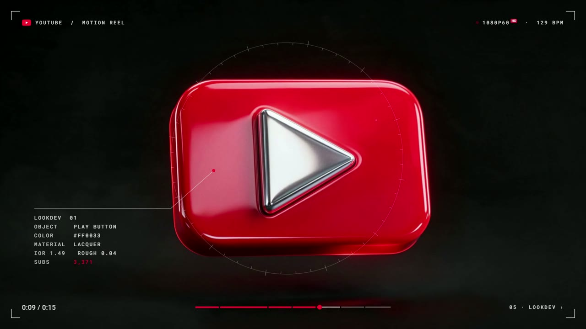

# Finished examples

## YouTube motion showreel

`youtube-showreel.mp4` is a 15-second showreel built with the `motion-showreel`
skill and supplied by Nate for publication: 1920x1080, 60fps, H.264 video and AAC
audio. Its generated lookdev shots came from Kie.ai, its music from Suno via
Kie.ai, and its sound effects from ElevenLabs. It is a design study, not an official
YouTube production.

## Short-form examples

These three videos were created by Nate and supplied for publication in this kit.
The MP4s are unchanged copies of the supplied exports, with simpler filenames.
All three are 1080x1920, with H.264 video and AAC audio.

Three finished videos created by Nate. Press Play to watch here in the README.

### Curiosity reel: unlock your project

https://github.com/user-attachments/assets/920cc3b7-6ef0-4324-aa98-870c1c2a07c5

### Curiosity reel: build a better AI system

https://github.com/user-attachments/assets/ba468302-fe07-4e4c-949b-68951dd84625

### AIS Live ad

https://github.com/user-attachments/assets/4ad48761-d14c-407a-9dec-1b76a9afb04a

Use these as finished-output references when planning your own hooks, captions,
visual pacing, and sound design. Editable source projects for these three videos
are not included. The showreel's source project is not included either. Their inclusion does not grant rights to third-party brands or
assets appearing within them. Bring your own recordings for the editing exercises.
